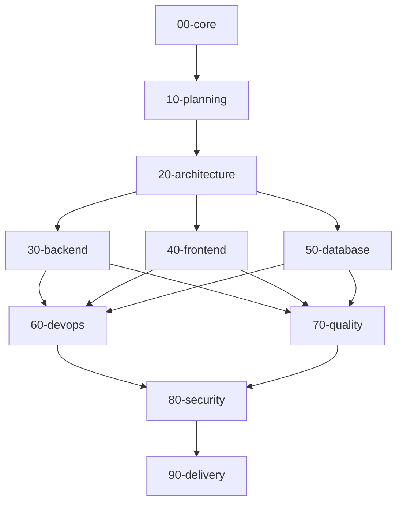

# Code-Skills

A curated catalog of 73 engineering skills for software delivery — from requirements
gathering and system design through backend/frontend implementation, databases, DevOps,
quality, security, and delivery practices. Each skill is a self-contained `SKILL.md`
document intended to be consumed by engineers and by coding agents that need a
consistent, repeatable playbook for a given task.

## Why this exists

Coding agents (and humans) benefit from having explicit, structured guidance for
recurring engineering tasks rather than re-deriving best practices from scratch every
time. Every skill in this repository follows the same shape — Purpose, When to
use/not use, Prerequisites, Workflow, Decision guide, Reference implementation,
Checklist, Anti-patterns, Verification, References — so they can be scanned quickly,
composed together, and validated automatically.

See `docs/agent-integration.md` for guidance on wiring this catalog into an agent's
workflow.

## How the catalog is organized



Skills flow roughly left-to-right through a project's lifecycle: establish shared
engineering habits (`core`), plan the work (`planning`), design the system
(`architecture`), build it (`backend`/`frontend`/`database`), operate it
(`devops`), verify it (`quality`), secure it (`security`), and ship it
(`delivery`). In practice you'll jump between categories freely — the numbering
is just a suggested reading order, not a rigid gate.

## Catalog

| Category | Folder | Skills | Description |
| --- | --- | --- | --- |
| Core | `skills/00-core/` | 5 | Baseline engineering habits and agent workflow loop shared across every task. |
| Planning | `skills/10-planning/` | 6 | Requirements, specs, estimation, ADRs, risk logs, and readiness gates. |
| Architecture | `skills/20-architecture/` | 11 | System design, DDD, API styles, event-driven design, caching, resilience, multi-tenancy. |
| Backend | `skills/30-backend/` | 11 | .NET solution structure, CQRS, data access, auth, messaging, mapping, configuration. |
| Frontend | `skills/40-frontend/` | 5 | Frontend architecture, design systems, accessibility, performance, state/forms. |
| Database | `skills/50-database/` | 5 | Data modeling, indexing, migrations, transactions, polyglot persistence. |
| DevOps | `skills/60-devops/` | 8 | Containers, Kubernetes, CI/CD, IaC, observability, release strategy, incident response, cost. |
| Quality | `skills/70-quality/` | 9 | Test strategy and design, unit/integration/E2E/perf testing, review, refactoring, debugging. |
| Security | `skills/80-security/` | 10 | OWASP, threat modeling, authN/Z hardening, secrets, supply chain, CI security, IR, privacy. |
| Delivery | `skills/90-delivery/` | 3 | Git workflow, technical documentation, and a pre-launch shipping checklist. |

Every skill is listed individually, with description, tags, and maturity, in the
generated index: **[docs/INDEX.md](docs/INDEX.md)**.

## Using a skill

1. Browse `docs/INDEX.md` or a category folder to find the relevant skill.
2. Open the skill's `SKILL.md` and read **When to use / When NOT to use** first to
   confirm it fits your situation.
3. Follow **Workflow** and consult **Decision guide** for situational choices.
4. Use **Reference implementation** as a starting point, not a copy-paste final answer.
5. Run through **Checklist** and **Verification** before considering the task done.

## Repository layout

```text
.
├── README.md
├── CONTRIBUTING.md
├── LICENSE
├── docs/                 # INDEX.md (generated), authoring guide, agent integration, glossary
├── templates/            # Templates for SKILL.md, ADRs, PRDs, test plans, threat models, runbooks
├── scripts/              # validate_skills.py, generate_index.py, new_skill.py
├── skills/               # 00-core ... 90-delivery, one folder per skill
└── .github/              # CI workflow, PR template, new-skill issue template
```

## Contributing a new skill

```bash
python scripts/new_skill.py --category 30-backend --name outbox-pattern
```

This scaffolds `skills/30-backend/outbox-pattern/SKILL.md` from
`templates/SKILL.template.md` with frontmatter pre-filled. Fill in every section, then
validate locally before opening a PR:

```bash
python scripts/validate_skills.py
python scripts/generate_index.py
```

See `CONTRIBUTING.md` and `docs/skill-authoring-guide.md` for the full authoring
conventions (frontmatter rules, required section order, description format, and
length guidance).

## Validation

Every push and pull request runs `.github/workflows/validate.yml`, which:

1. Installs Python and PyYAML.
2. Runs `python scripts/validate_skills.py` — checks frontmatter, section order,
   naming, and internal links across every `SKILL.md`.
3. Runs `python scripts/generate_index.py --check` — fails if `docs/INDEX.md` is
   stale relative to the skills on disk.
4. Runs `markdownlint` against the repository's Markdown files.

## License

See [LICENSE](LICENSE).
