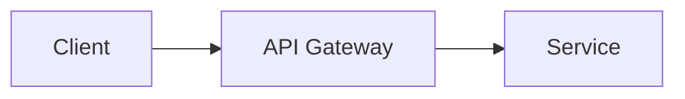

# Skill Authoring Guide

This guide explains how to write a new skill for the Code-Skills catalog so
that it passes `scripts/validate_skills.py` on the first try and is genuinely
useful to a coding agent or a human engineer.

## 1. Start from the template

Never hand-roll the frontmatter or section headings. Use the scaffolding
script:

```bash
python scripts/new_skill.py --category 30-backend --name outbox-pattern
```

This creates `skills/30-backend/outbox-pattern/SKILL.md` pre-filled from
`templates/SKILL.template.md` with the `name`, `category`, and `updated`
fields already correct.

## 2. Frontmatter rules

```yaml
---
name: outbox-pattern          # kebab-case, must equal the folder name
description: Use when you need to publish domain events reliably alongside a database transaction.
category: backend             # one of the 10 allowed slugs, see below
tags: [messaging, reliability]
maturity: draft                # draft | stable
updated: 2026-08-21
---
```

- `name` must be kebab-case (`^[a-z0-9]+(-[a-z0-9]+)*$`) and match the parent
  folder exactly.
- `description` is a single sentence, **must start with the literal text
  "Use when"**, and must be 400 characters or fewer. It should describe the
  triggering situation, not the skill's internal mechanics.
- `category` must be exactly one of: `core`, `planning`, `architecture`,
  `backend`, `frontend`, `database`, `devops`, `quality`, `security`,
  `delivery`.
- `tags` is a short YAML list of lowercase keywords used for search.
- `maturity` is `draft` while the skill is new/unreviewed, and `stable` once
  a peer has reviewed it in a PR.
- `updated` is an ISO date (`YYYY-MM-DD`) bumped whenever the content
  materially changes.
- No other frontmatter keys are permitted; the validator rejects unknown
  keys so that the schema stays predictable for tooling.

## 3. Required section structure

Every `SKILL.md` must contain exactly these ten H2 (`##`) sections, in this
exact order. You may add H3 subsections freely inside each one, but you
cannot rename, remove, reorder, or duplicate the H2 headings themselves:

1. `## Purpose`
2. `## When to use / When NOT to use`
3. `## Prerequisites`
4. `## Workflow`
5. `## Decision guide`
6. `## Reference implementation`
7. `## Checklist`
8. `## Anti-patterns`
9. `## Verification`
10. `## References`

The validator scans for these headings with a simple ordered-match; extra
prose and code blocks between them are fine, but skipping or reordering a
heading fails validation.

## 4. Content guidelines

- **Length:** aim for 200-350 lines; the hard ceiling enforced by the
  validator is 500 lines, and the spec target is 150-400.
- **Purpose:** two or three sentences on the problem being solved and why it
  matters — not a restatement of the title.
- **When to use / When NOT to use:** concrete, falsifiable bullet points.
  Avoid vague statements like "when appropriate".
- **Workflow:** a numbered, step-by-step procedure an agent can follow
  mechanically. Each step should be an imperative action.
- **Decision guide:** a markdown table mapping situations to
  recommendations — this is what lets an agent pick the right variant of a
  pattern quickly.
- **Reference implementation:** a real, runnable-looking code snippet under
  roughly 60 lines. Use C#/.NET 8 for backend skills, TypeScript for
  frontend skills, YAML/HCL for infrastructure skills, and SQL for database
  skills. Architecture skills should include a Mermaid diagram here or in
  the Workflow section.
- **Checklist:** actionable, verifiable checkbox items — things a reviewer
  can literally tick off.
- **Anti-patterns:** name the mistake, then explain the correct approach in
  the same bullet.
- **Verification:** describe how to confirm the skill's guidance was
  correctly applied (a command to run, a review question, a metric to
  check).
- **References:** links to authoritative external sources (standards, docs,
  well-known books/articles) or to other skills in this repo.

## 5. Diagrams

Any skill in `skills/20-architecture/` (and any other skill describing a
system's structure or flow) should include a Mermaid diagram, fenced as:

````markdown

````

## 6. Links

Relative links (e.g. `../../90-delivery/technical-documentation/SKILL.md`)
must resolve to real files — the validator checks this. Prefer linking to
other skills over duplicating their content.

## 7. Before opening a PR

1. Run `python scripts/validate_skills.py` and fix every reported issue.
2. Run `python scripts/generate_index.py` to refresh `docs/INDEX.md`.
3. Run markdownlint locally if available: `npx markdownlint-cli '**/*.md'`.
4. Set `maturity: stable` only after the skill has been reviewed.
