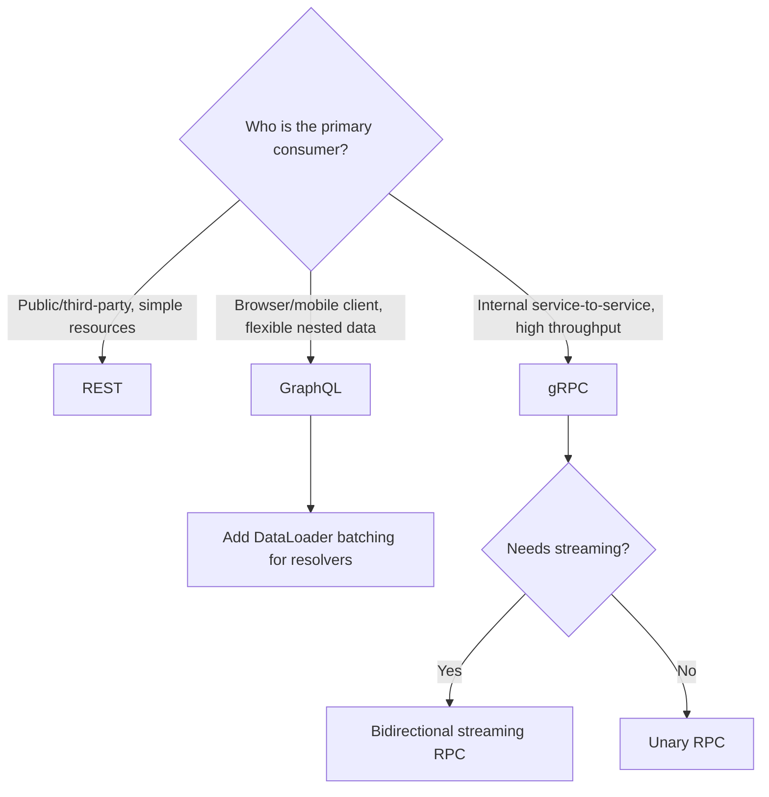

## Purpose

REST is not always the right fit: client applications needing flexible, nested data fetching benefit from GraphQL, while internal service-to-service calls needing low latency and strong typing benefit from gRPC. This skill explains when each is appropriate and the core design practices for each.

Choosing the wrong protocol for the situation creates either over-fetching/under-fetching pain (REST/GraphQL mismatch) or unnecessary operational complexity (gRPC for a public-facing API).

## When to use / When NOT to use

**Use this skill when:**

- A client application needs to fetch varying, nested combinations of data efficiently — consider GraphQL.
- Multiple frontend teams need different shapes of the same underlying data.
- Two internal services need frequent, low-latency, strongly-typed calls — consider gRPC.
- You are designing streaming or bidirectional communication between backend services.

**Do NOT use this skill when:**

- The API is simple CRUD with a small number of consumers — plain REST (skills/20-architecture/api-design-rest/SKILL.md) is simpler to operate.
- The API must be easily callable from arbitrary HTTP clients/browsers without special tooling — avoid gRPC for public-facing APIs.

## Prerequisites

- skills/20-architecture/api-design-rest/SKILL.md read first, to confirm REST does not fit.
- Confirmed consumer needs (browser client vs internal service) driving the protocol choice.

## Workflow

1. **Confirm the protocol fits the consumer** - GraphQL for flexible client-driven queries over HTTP/browsers; gRPC for internal, high-throughput, strongly-typed service calls.
2. **Design the schema/contract first** - Write the GraphQL SDL or protobuf .proto file before implementation, and treat it as the API contract.
3. **Model GraphQL types around the domain, not the database** - Avoid exposing raw ORM shapes; define types that make sense to API consumers.
4. **Avoid the N+1 query problem in GraphQL** - Use a batching/dataloader pattern for resolvers that fetch related entities.
5. **Design gRPC services around use cases** - Define RPC methods as specific operations, not a generic CRUD wrapper around internal storage.
6. **Version deliberately** - GraphQL evolves via additive schema changes and deprecation directives; gRPC evolves via backward-compatible protobuf field numbering.
7. **Set explicit query limits for GraphQL** - Apply depth and complexity limits to prevent a single query from causing excessive backend load.

## Decision guide

| Situation | Recommended approach |
| --- | --- |
| Public-facing API for third-party developers | Prefer REST or GraphQL over gRPC, since gRPC tooling is harder for arbitrary external clients. |
| Internal service mesh with polyglot services | gRPC is a strong fit due to protobuf's cross-language code generation and HTTP/2 performance. |
| Mobile client needs to minimize round trips for a complex screen | GraphQL's single-request nested queries reduce round trips versus multiple REST calls. |
| Need for streaming updates between services | gRPC's native streaming support fits better than polling a REST endpoint. |
| A GraphQL resolver is causing N+1 database queries | Introduce a DataLoader/batching layer rather than accepting the performance hit. |
| A protobuf field needs to be removed | Reserve its field number and name rather than reusing it, to avoid breaking old clients. |

## Reference implementation

Choosing between REST, GraphQL, and gRPC based on consumer and use case:



- This decision tree is a starting heuristic, not a rigid rule — some APIs legitimately expose both REST and GraphQL for different consumers.
- A gRPC-web gateway can bridge browser clients to gRPC backends if truly needed, but adds operational complexity.

### A minimal gRPC service contract (protobuf)

A use-case-oriented gRPC service definition, not a generic CRUD wrapper:

```protobuf
syntax = "proto3";
package orders.v1;

service OrderService {
  rpc PlaceOrder (PlaceOrderRequest) returns (PlaceOrderResponse);
  rpc StreamOrderUpdates (StreamOrderUpdatesRequest) returns (stream OrderUpdate);
}

message PlaceOrderRequest {
  string customer_id = 1;
  repeated OrderLine lines = 2;
}

message OrderLine {
  string product_id = 1;
  int32 quantity = 2;
}

message PlaceOrderResponse {
  string order_id = 1;
  string status = 2;
}
```

## Checklist

- [ ] The chosen protocol matches the actual consumer (browser/public vs internal service).
- [ ] A schema/contract (SDL or .proto) exists and is treated as the source of truth.
- [ ] GraphQL resolvers avoid N+1 queries via batching/dataloaders.
- [ ] GraphQL queries have depth/complexity limits to prevent runaway queries.
- [ ] gRPC services are modeled around use cases, not generic CRUD passthroughs.
- [ ] Protobuf field numbers are never reused after removal; deprecated fields are reserved.
- [ ] Versioning strategy (additive GraphQL schema evolution, protobuf compatibility rules) is documented.

## Anti-patterns

- **GraphQL over a raw ORM** - Exposing database entities directly as GraphQL types, leaking internal schema details and coupling the API to storage.
- **Unbounded GraphQL queries** - Allowing arbitrarily deep or wide queries with no complexity limit, letting one client request take down the backend.
- **gRPC for public APIs** - Exposing gRPC directly to third-party/browser consumers who lack easy tooling to call it, creating adoption friction.
- **N+1 resolver chains** - Fetching related entities one at a time per parent in a GraphQL resolver instead of batching.
- **Reusing protobuf field numbers** - Assigning a removed field's number to a new field, causing old clients to misinterpret data.

## Verification

- Load testing a nested GraphQL query confirms resolvers are batched, not causing N+1 queries.
- A complexity/depth limit rejects a deliberately excessive test query.
- A protobuf schema change passes a backward-compatibility check (e.g. buf breaking) before merge.
- Consumers can successfully generate typed clients from the published schema/contract.

## References

- GraphQL.org — Official specification and best practices.
- gRPC.io — Official documentation.
- skills/20-architecture/api-design-rest/SKILL.md
- Buf — protobuf schema linting and breaking-change detection.
