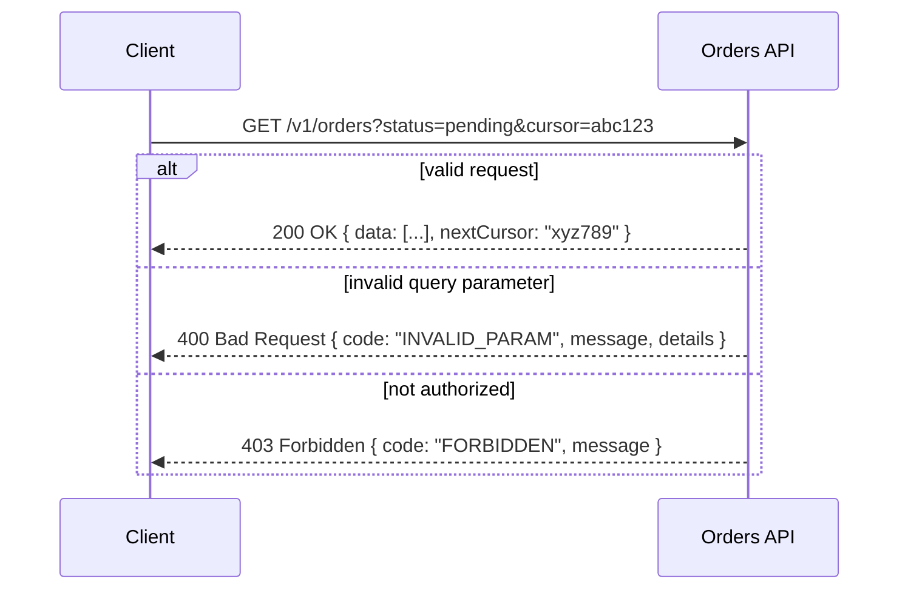

## Purpose

Inconsistent REST APIs — mismatched status codes, ad hoc pagination, breaking changes without versioning — create integration pain for every consumer. This skill defines a consistent set of REST conventions covering resource modeling, HTTP verbs, status codes, error shapes, pagination, and versioning.

It is meant to be applied uniformly across a service's endpoints so that consumers can predict behavior for any new endpoint without reading its docs.

## When to use / When NOT to use

**Use this skill when:**

- You are designing a new HTTP API or a new set of endpoints on an existing one.
- You are reviewing an API design PR for consistency with the rest of the platform.
- Consumers report unpredictable error shapes or inconsistent pagination across endpoints.
- You need to introduce a breaking change and must decide how to version it.

**Do NOT use this skill when:**

- The interface is internal-only, high-frequency, and better served by gRPC — see skills/20-architecture/api-design-graphql-and-grpc/SKILL.md.
- Consumers need flexible, client-specified queries across many resource types — consider GraphQL instead.

## Prerequisites

- Confirmed resource model (skills/20-architecture/domain-driven-design/SKILL.md if the domain is complex).
- Agreement on the API's versioning strategy before the first endpoint ships.
- skills/30-backend/validation-and-error-handling/SKILL.md for the error response shape.

## Workflow

1. **Model resources as nouns** - Design URLs around resources (/orders/{id}) not actions (/getOrder); use HTTP verbs for actions.
2. **Choose verbs and status codes consistently** - GET=200, POST=201 with Location header, PUT/PATCH=200/204, DELETE=204; 4xx for client errors, 5xx for server errors.
3. **Define a standard error shape** - Use one consistent JSON error envelope (code, message, details) across every endpoint, including validation failures.
4. **Design pagination up front** - Use cursor or offset pagination consistently, with total count and next-page links, for every list endpoint.
5. **Version from day one** - Include a version in the URL or header (/v1/orders) even for the first release, so breaking changes have a clear path.
6. **Support partial responses / filtering deliberately** - Decide explicitly which endpoints support field selection or filtering, and document the query parameter convention.
7. **Document with an OpenAPI spec** - Generate or hand-write an OpenAPI document as the source of truth, kept in sync with the implementation.
8. **Review against existing endpoints** - Check new endpoints against existing ones in the same API for naming, status code, and error consistency.

## Decision guide

| Situation | Recommended approach |
| --- | --- |
| Deciding a resource's identifier format | Use opaque, stable IDs (GUID or ULID) rather than exposing internal database auto-increment integers. |
| An operation doesn't fit CRUD naturally (e.g. 'cancel order') | Model it as a sub-resource action: POST /orders/{id}/cancel rather than a verb in the path. |
| A breaking change is required | Introduce a new version (/v2/...) and support both versions during a deprecation window rather than breaking v1 consumers. |
| Client needs to fetch a large, deeply nested object graph | Consider a dedicated aggregate endpoint or move that consumer to GraphQL rather than over-nesting REST responses. |
| List endpoint result set can grow unbounded | Use cursor-based pagination instead of offset-based to avoid skipped/duplicated results under concurrent writes. |
| An error can have multiple causes (e.g. multiple invalid fields) | Return all validation errors in one response, not just the first one encountered. |
| A partner consumer requires stability guarantees | Document a deprecation policy and minimum notice period in the API contract. |

## Reference implementation

Standard request/response flow for a resource collection endpoint with pagination and errors:



- Keep the error envelope shape identical across 400/403/404/409/500 — only the code and message content differ.
- cursor-based pagination avoids the duplicate/skip problem offset pagination has under concurrent inserts/deletes.

### Minimal ASP.NET Core controller following these conventions (C#)

A list endpoint with cursor pagination and a consistent error envelope:

```csharp
[ApiController]
[Route("v1/orders")]
public class OrdersController : ControllerBase
{
    private readonly IOrderQueryService _queries;
    public OrdersController(IOrderQueryService queries) => _queries = queries;

    [HttpGet]
    public async Task<ActionResult<PagedResult<OrderSummary>>> List(
        [FromQuery] string? status, [FromQuery] string? cursor, [FromQuery] int pageSize = 20)
    {
        if (pageSize is < 1 or > 100)
            return BadRequest(ApiError.From("INVALID_PARAM", "pageSize must be 1-100."));

        var result = await _queries.ListAsync(status, cursor, pageSize);
        return Ok(result); // { data, nextCursor, totalCount }
    }

    [HttpPost("{id:guid}/cancel")]
    public async Task<IActionResult> Cancel(Guid id)
    {
        await _queries.CancelAsync(id);
        return NoContent(); // 204
    }
}
```

## Checklist

- [ ] URLs are resource-oriented nouns; actions that don't fit CRUD use a sub-resource verb path.
- [ ] Status codes and verbs are used consistently across every endpoint in the API.
- [ ] Every error response uses the same envelope shape, including validation errors.
- [ ] Every list endpoint uses the same pagination approach with a documented convention.
- [ ] The API is versioned from its first release.
- [ ] An OpenAPI spec exists and is kept in sync with the implementation.
- [ ] IDs exposed to clients are opaque and stable, not internal auto-increment integers.
- [ ] A deprecation policy exists for any breaking change across versions.

## Anti-patterns

- **Verb-based URLs** - Endpoints like /getOrder or /createOrder instead of resource nouns with proper HTTP verbs.
- **Inconsistent error shapes** - Different endpoints returning different JSON structures for errors, forcing clients to special-case each one.
- **Unversioned breaking changes** - Changing a field's type or removing it from a response without a new API version, breaking existing consumers silently.
- **Leaky internal IDs** - Exposing database auto-increment integers as public identifiers, revealing internal scale and enabling enumeration.
- **Offset pagination at scale** - Using page/offset pagination on a frequently-changing large dataset, causing skipped or duplicated rows for clients paging through results.
- **200 for everything** - Returning HTTP 200 with an 'error' field in the body instead of proper 4xx/5xx status codes.

## Verification

- A new endpoint added to the API matches the status code and error shape of existing endpoints without special-casing.
- The OpenAPI spec validates against the actual implementation (e.g. via contract tests).
- A breaking change was shipped behind a new version with the old version still functioning during the deprecation window.
- Pagination behaves correctly under concurrent writes (spot-checked with a test that inserts rows mid-pagination).

## References

- Microsoft REST API Guidelines.
- RFC 7807 — Problem Details for HTTP APIs.
- skills/30-backend/validation-and-error-handling/SKILL.md
- skills/20-architecture/api-design-graphql-and-grpc/SKILL.md
