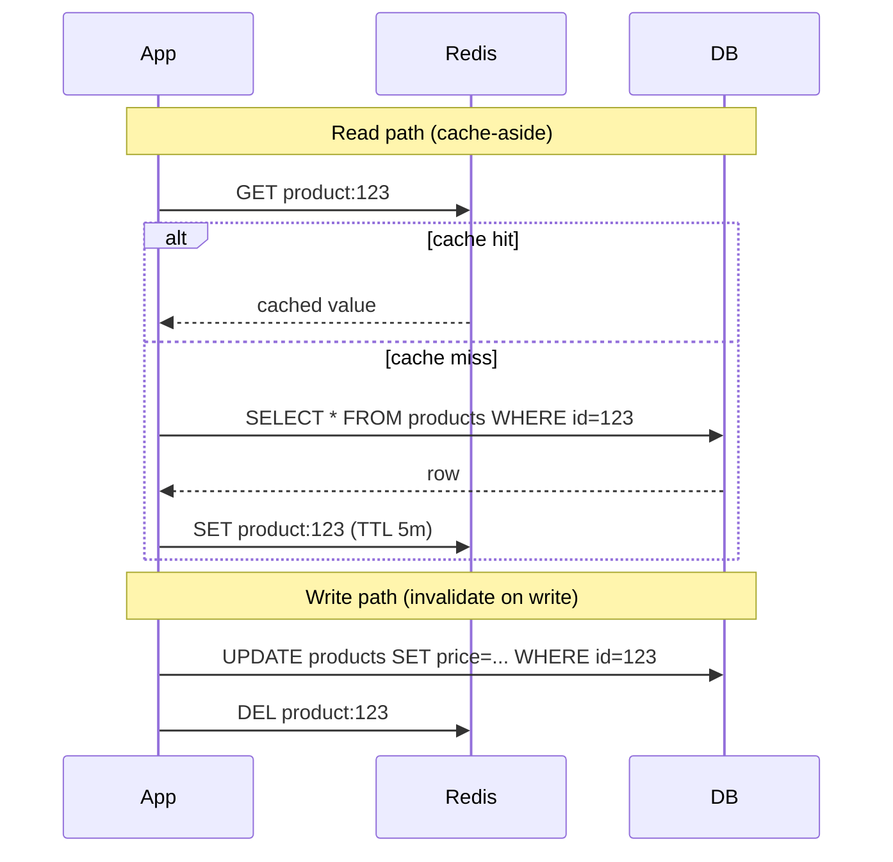

## Purpose

Caching is one of the highest-leverage performance techniques available, but done carelessly it trades latency problems for consistency and cache-invalidation problems. This skill provides a framework for choosing what to cache, at which layer, with which invalidation strategy, before reaching for caching as a default fix for slow reads.

It emphasizes that caching should follow a measured bottleneck, not be applied speculatively everywhere a read exists.

## When to use / When NOT to use

**Use this skill when:**

- A specific read path has been measured as a latency or database load bottleneck.
- Data is read far more often than it changes (high read/write ratio).
- An expensive computation or aggregation is repeated for the same inputs frequently.
- You need to protect a downstream system (DB, third-party API) from repeated identical requests.

**Do NOT use this skill when:**

- The data changes on every read or must always reflect the absolute latest state (e.g. account balance mid-transaction).
- No measured performance problem exists yet — do not cache speculatively.

## Prerequisites

- A measured baseline (latency, DB load) showing the bottleneck cache is meant to fix.
- A caching layer available (in-process, Redis, or a CDN depending on the layer).
- Clarity on the acceptable staleness window for the cached data.

## Workflow

1. **Confirm the bottleneck with data** - Profile or measure the specific read path before deciding to cache it.
2. **Choose the caching layer** - Client/CDN cache for static/public content; distributed cache (Redis) for shared application data; in-process cache for very hot, small, per-instance data.
3. **Define the cache key precisely** - Include every parameter that affects the result (tenant ID, locale, filters) to avoid serving wrong data to the wrong request.
4. **Choose an invalidation strategy** - Time-based expiry (TTL) for tolerable staleness; explicit invalidation on write for strict consistency needs.
5. **Handle cache misses safely** - Use request coalescing or locking to prevent a 'thundering herd' of duplicate work when a popular key expires.
6. **Set a sensible TTL** - Base TTL on how stale the data can acceptably be, not an arbitrary default.
7. **Plan for cache failure** - Ensure the system still functions (slower, not broken) if the cache is unavailable — never make it a single point of failure for correctness.
8. **Monitor hit rate and staleness** - Track cache hit ratio and, where relevant, how often stale data was actually served.

## Decision guide

| Situation | Recommended approach |
| --- | --- |
| Data changes rarely and staleness of minutes is fine | Use TTL-based expiry in a distributed cache; simplest and usually sufficient. |
| Data must reflect the very latest write immediately after it happens | Use explicit invalidation on write (cache-aside with delete-on-write) rather than relying on TTL alone. |
| A hot key is read by every request (e.g. feature flag config) | Consider an in-process cache with a short refresh interval to avoid a network hop per request. |
| Cache and database can drift under concurrent writes | Prefer cache-aside with invalidation over write-through if strict consistency during races matters, and accept brief staleness windows. |
| A popular cache key just expired under high load | Use request coalescing (single-flight) so only one request recomputes it while others wait for the result. |
| Cached data is user- or tenant-specific | Always include the user/tenant ID in the cache key — never share cache entries across security boundaries. |

## Reference implementation

Cache-aside pattern with explicit invalidation on write:



- Delete-on-write rather than update-on-write avoids the cache ever holding a partially-applied or racing write.
- A short TTL acts as a safety net in case an invalidation is ever missed.

### Cache-aside implementation with request coalescing (C#)

Using IMemoryCache's GetOrCreateAsync to avoid duplicate work on concurrent misses:

```csharp
public class ProductCacheService
{
    private readonly IDistributedCache _cache;
    private readonly IProductRepository _repo;

    public async Task<ProductDto?> GetProductAsync(Guid id)
    {
        var key = $"product:{id}";
        var cached = await _cache.GetStringAsync(key);
        if (cached is not null)
            return JsonSerializer.Deserialize<ProductDto>(cached);

        var product = await _repo.GetByIdAsync(id);
        if (product is null) return null;

        var dto = ProductDto.FromEntity(product);
        await _cache.SetStringAsync(key, JsonSerializer.Serialize(dto),
            new DistributedCacheEntryOptions { AbsoluteExpirationRelativeToNow = TimeSpan.FromMinutes(5) });
        return dto;
    }

    public async Task InvalidateAsync(Guid id) => await _cache.RemoveAsync($"product:{id}");
}
```

## Checklist

- [ ] The cached read path was measured as an actual bottleneck before adding caching.
- [ ] Cache keys include every parameter that affects the cached result (tenant, locale, filters).
- [ ] An explicit invalidation or TTL strategy matches the data's real staleness tolerance.
- [ ] The system degrades gracefully (slower, not broken/incorrect) if the cache is unavailable.
- [ ] Thundering-herd protection exists for popular keys that expire under load.
- [ ] Cache hit rate is monitored, and TTLs are tuned based on observed data.
- [ ] User/tenant-specific data is never cached under a shared key across security boundaries.

## Anti-patterns

- **Speculative caching** - Adding a cache layer to a read path with no measured performance problem, adding complexity for no benefit.
- **Incomplete cache keys** - Omitting a parameter like tenant ID from the cache key, causing one tenant to see another tenant's cached data.
- **Cache as source of truth** - Treating the cache as authoritative and losing data if it's evicted, instead of always being able to rebuild from the real source.
- **Unbounded TTLs** - Caching data forever with no expiry, leading to permanently stale results after the underlying data changes.
- **No thundering-herd protection** - Letting a popular key's expiry cause a stampede of duplicate expensive recomputation.
- **Cache failure as total failure** - Building a design where cache unavailability makes the whole feature unusable instead of degrading gracefully.

## Verification

- A load test confirms the cached path meets its latency target under expected traffic.
- Cache invalidation is confirmed to remove stale data within the required window after a write.
- A simulated cache outage shows the system still functions, just slower.
- Cache hit ratio is visible on a dashboard and matches expectations for the access pattern.

## References

- skills/20-architecture/scalability-and-capacity-planning/SKILL.md
- Martin Kleppmann, 'Designing Data-Intensive Applications' — caching and consistency trade-offs.
- Redis documentation — cache-aside and expiration strategies.
