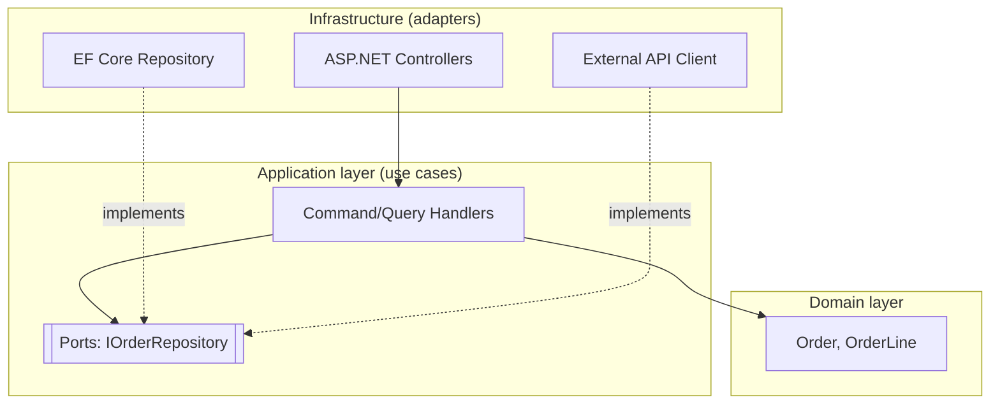

## Purpose

Business logic tightly coupled to a specific database or web framework becomes expensive to test and impossible to evolve independently. Clean/Onion architecture inverts the traditional dependency direction so infrastructure depends on the domain, not the other way around.

This skill shows how to structure a .NET solution (or equivalent) into concentric layers with dependencies pointing strictly inward, and how to enforce that boundary in practice, not just in a diagram.

## When to use / When NOT to use

**Use this skill when:**

- You are starting a new backend service and choosing its internal layering.
- Business logic is currently entangled with Entity Framework, ASP.NET, or another framework.
- You need to unit test business rules without spinning up a database or web server.
- Multiple infrastructure choices (DB, message broker) may need to change over the service's life.

**Do NOT use this skill when:**

- The service is a thin proxy or pass-through with no real business logic to isolate.
- The team is a single small script/tool where the layering overhead outweighs the benefit.

## Prerequisites

- skills/20-architecture/domain-driven-design/SKILL.md concepts if the domain is non-trivial.
- A dependency injection container available in the chosen framework.
- Agreement within the team on where the boundary lines are drawn.
- skills/30-backend/dotnet-solution-bootstrap/SKILL.md if starting a new .NET solution.

## Workflow

1. **Define the domain layer first** - Model entities, value objects, and domain services with zero framework references.
2. **Define application layer use cases** - Express each use case (command/query) as an explicit class or method orchestrating domain objects.
3. **Define ports as interfaces in the inner layers** - Repository and external-service interfaces live in the domain/application layer, not infrastructure.
4. **Implement adapters in the outer layer** - EF Core repositories, HTTP clients, and messaging adapters implement the inner-layer interfaces.
5. **Wire dependencies at the composition root** - Only the outermost startup project references concrete infrastructure implementations.
6. **Enforce the dependency rule** - Use project references (or architecture tests) so inner layers physically cannot reference outer layers.
7. **Keep controllers/handlers thin** - API controllers should only translate HTTP to application layer calls, with no business logic inline.
8. **Test business logic in isolation** - Unit test the domain and application layers without any database, HTTP, or framework dependency.

## Decision guide

| Situation | Recommended approach |
| --- | --- |
| Where to put validation logic | Structural/format validation in the application layer input model; business rule validation inside domain entities. |
| Where to put a repository interface | In the domain or application layer (the 'port'); its EF Core implementation belongs in infrastructure (the 'adapter'). |
| A use case needs data from two aggregates | Coordinate in the application layer service/handler, not by having one aggregate directly reference another. |
| Team is tempted to skip layering for 'a simple CRUD endpoint' | Still separate a thin application layer if the entity has any real behavior; skip only for pure pass-through data. |
| Framework attributes leak into domain classes | Move framework-specific concerns (e.g. [Column], [JsonProperty]) to separate DTOs/EF configuration classes instead. |
| New infrastructure choice replaces an old one | Only the adapter implementation changes; the domain/application layers and their tests remain untouched — this is the payoff of the pattern. |

## Reference implementation

Layer dependency direction — arrows point inward, never outward:



- Dotted arrows show 'implements' — the infrastructure depends on the port interface, not vice versa.
- Only the composition root (startup project) is allowed to reference both application and infrastructure projects.

### Enforcing the dependency rule with a project reference (.csproj layout)

A solution layout that makes violating the dependency rule a compile error:

```text
src/
  Domain/                 (no project references)
  Application/            references: Domain
  Infrastructure/         references: Application, Domain
  Api/                    references: Application, Infrastructure (composition root)

Domain.csproj must NOT reference Infrastructure.csproj or Api.csproj.
A CI check (e.g. NetArchTest) can assert this automatically:

  Types.InAssembly(typeof(Order).Assembly)
      .Should().NotHaveDependencyOn("Infrastructure")
      .GetResult().IsSuccessful.Should().BeTrue();
```

## Checklist

- [ ] Domain layer has zero references to web frameworks, ORMs, or infrastructure packages.
- [ ] Application layer defines use cases and port interfaces, without infrastructure detail.
- [ ] Infrastructure layer implements ports; no port lives in the infrastructure project.
- [ ] Controllers/handlers are thin translators, not homes for business logic.
- [ ] Domain and application layer logic is unit tested without a database or HTTP server.
- [ ] Project references (or an architecture test) physically enforce the dependency direction.
- [ ] Swapping an infrastructure implementation does not require changing domain/application code.

## Anti-patterns

- **Anemic layering in name only** - Having Domain/Application/Infrastructure folders that still freely reference each other in any direction, defeating the purpose.
- **Fat controllers** - Putting business rule logic directly in API controllers instead of application/domain layers.
- **Leaky infrastructure types** - Returning EF Core entities or ORM-tracked types directly from application layer methods, coupling callers to the ORM.
- **Framework attributes on domain entities** - Decorating domain classes with ORM or JSON serialization attributes, coupling them to infrastructure concerns.
- **Testing only through the API** - Skipping unit tests for domain/application logic and only testing via slow, database-backed integration tests.

## Verification

- An architecture test (or manual review) confirms Domain has no outward dependencies.
- Unit tests for domain/application logic run without a database connection or HTTP server.
- A sample infrastructure swap (e.g. mocking a repository) requires no change to application/domain code.
- Code review confirms controllers contain no business rule logic.

## References

- Robert C. Martin, 'Clean Architecture'.
- Jeffrey Palermo, original Onion Architecture articles.
- skills/20-architecture/domain-driven-design/SKILL.md
- skills/30-backend/dotnet-solution-bootstrap/SKILL.md
