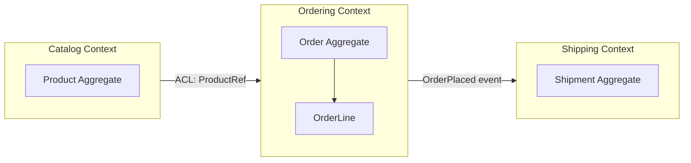

## Purpose

Complex business domains modeled as generic CRUD entities lose meaning: business rules end up scattered across services with no single place that represents 'what the business actually means'. Domain-Driven Design (DDD) provides tactical and strategic patterns — bounded contexts, aggregates, ubiquitous language — to keep the code's model aligned with the business's model.

This skill focuses on applying DDD pragmatically to real projects, not on academic completeness; not every system needs full DDD rigor.

## When to use / When NOT to use

**Use this skill when:**

- The domain has complex business rules that change based on real-world policy, not just data shape.
- Multiple teams have different, sometimes conflicting, meanings for the same term (e.g. 'Customer').
- You are decomposing a monolith and need principled boundaries, not arbitrary ones.
- Domain experts and engineers currently struggle to communicate using a shared vocabulary.

**Do NOT use this skill when:**

- The system is a simple CRUD application with little real business logic.
- The team is too small to sustain the discovery and modeling overhead DDD requires.

## Prerequisites

- Access to domain experts for event storming or similar discovery sessions.
- skills/20-architecture/system-design-process/SKILL.md applied at the system level first.

## Workflow

1. **Run domain discovery** - Facilitate event storming or similar sessions with domain experts to surface real business events, commands, and rules.
2. **Identify bounded contexts** - Group related concepts into contexts where a term has one unambiguous meaning (e.g. 'Product' means something different in Catalog vs Shipping).
3. **Define the ubiquitous language per context** - Agree on precise terms with domain experts and use them verbatim in code — class names, not synonyms.
4. **Model aggregates around invariants** - Group entities that must be consistent together into an aggregate with a single root enforcing its invariants.
5. **Define context boundaries and relationships** - Document how contexts relate: shared kernel, customer-supplier, anti-corruption layer, etc.
6. **Keep the domain model free of infrastructure** - Domain entities should not know about databases, HTTP, or frameworks — see skills/20-architecture/clean-and-onion-architecture/SKILL.md.
7. **Validate with domain experts** - Walk real scenarios through the model with domain experts to confirm it matches their mental model.

## Decision guide

| Situation | Recommended approach |
| --- | --- |
| Two teams use the same word differently | Split into separate bounded contexts rather than forcing one shared meaning. |
| An aggregate is growing very large | Check whether it is enforcing more than one true invariant; split along invariant boundaries. |
| Integrating with a legacy or third-party system | Introduce an anti-corruption layer to translate its model into your bounded context's language. |
| Domain has little real complexity | Skip full DDD tactical patterns; a simpler CRUD/service layer is more appropriate. |
| A rule changes based on business policy, not data | Model it as an explicit domain concept (e.g. a Policy or Specification object), not a scattered if-statement. |
| Cross-context consistency seems needed instantly | Prefer eventual consistency via domain events between contexts over a distributed transaction. |

## Reference implementation

Bounded contexts and their relationships for an e-commerce platform:



- The 'ACL' label shows Catalog's Product is translated through an anti-corruption layer before Ordering uses it.
- OrderPlaced crossing to Shipping via an event, not a direct call, keeps the contexts loosely coupled.

### An aggregate enforcing its own invariant (C#)

A minimal Order aggregate that protects a real business invariant:

```csharp
public class Order
{
    private readonly List<OrderLine> _lines = new();
    public IReadOnlyList<OrderLine> Lines => _lines;
    public OrderStatus Status { get; private set; } = OrderStatus.Draft;

    public void AddLine(ProductRef product, int quantity)
    {
        if (Status != OrderStatus.Draft)
            throw new DomainException("Cannot modify a submitted order.");
        if (quantity <= 0)
            throw new DomainException("Quantity must be positive.");
        _lines.Add(new OrderLine(product, quantity));
    }

    public void Submit()
    {
        if (_lines.Count == 0)
            throw new DomainException("Cannot submit an order with no lines.");
        Status = OrderStatus.Submitted;
    }
}
```

## Checklist

- [ ] Bounded contexts are identified with explicit, non-overlapping meanings for shared terms.
- [ ] The ubiquitous language is used verbatim in code (class/method names match domain expert vocabulary).
- [ ] Each aggregate enforces exactly the invariants it needs to, and no more.
- [ ] Domain entities have no direct dependency on infrastructure (DB, HTTP, frameworks).
- [ ] Cross-context communication uses events or anti-corruption layers, not shared database access.
- [ ] The model was validated against real scenarios with domain experts.

## Anti-patterns

- **Anemic domain model** - Entities that are just data bags with all logic living in separate 'service' classes, losing the benefit of DDD.
- **God aggregate** - One aggregate root spanning the entire domain, causing contention and unclear consistency boundaries.
- **Shared database as integration** - Multiple bounded contexts reading/writing the same tables directly instead of communicating via explicit contracts.
- **Vocabulary mismatch** - Code using generic technical names (Manager, Helper, Data) instead of the domain experts' actual terms.
- **DDD everywhere** - Applying full tactical DDD patterns to simple CRUD subdomains that do not need the complexity.

## Verification

- A domain expert can read the aggregate/entity names and recognize their own vocabulary.
- Each bounded context's model is internally consistent and does not silently depend on another context's internals.
- Invariant-breaking operations are impossible to construct in code (compiler/runtime enforced, not just convention).

## References

- Eric Evans, 'Domain-Driven Design'.
- Vaughn Vernon, 'Implementing Domain-Driven Design'.
- skills/20-architecture/clean-and-onion-architecture/SKILL.md
- skills/20-architecture/modular-monolith-vs-microservices/SKILL.md
