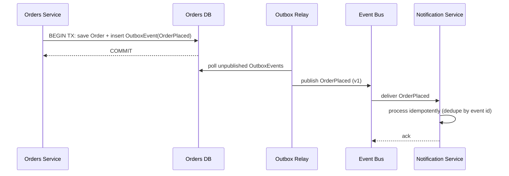

## Purpose

Synchronous calls between services couple their availability and latency together: if the downstream service is slow or down, the caller is too. Event-driven architecture decouples producers and consumers in time by routing state changes through an event bus or broker.

This skill covers designing event schemas, choosing delivery guarantees, and avoiding the common pitfalls of eventual consistency and duplicate/out-of-order delivery.

## When to use / When NOT to use

**Use this skill when:**

- Multiple services need to react to the same state change without direct coupling.
- A downstream operation can tolerate eventual consistency (seconds to minutes, not immediate).
- You need to decouple a slow or unreliable downstream integration from the main transaction.
- You are building an audit trail or need to replay history of what happened over time.

**Do NOT use this skill when:**

- The operation requires an immediate, synchronous response to the caller (e.g. checking real-time inventory before confirming a purchase).
- The team has no operational experience with message brokers and the complexity is not yet justified.

## Prerequisites

- A message broker or event bus available (e.g. Kafka, RabbitMQ, Azure Service Bus, SNS/SQS).
- skills/30-backend/background-jobs-and-messaging/SKILL.md for the consumer-side implementation.
- Agreement on event schema versioning and ownership per bounded context.

## Workflow

1. **Identify the domain events** - List meaningful business state changes (OrderPlaced, PaymentFailed) from the domain model, not just CRUD operations.
2. **Design the event schema** - Include a stable event type, version, timestamp, and enough context for consumers to act without calling back the producer.
3. **Choose a delivery guarantee** - Decide between at-least-once (most common, requires idempotent consumers) and at-most-once based on the use case's tolerance for loss vs duplication.
4. **Use the outbox pattern for reliability** - Persist the event in the same transaction as the state change, then publish asynchronously, to avoid dual-write inconsistency.
5. **Make consumers idempotent** - Design consumers to safely process the same event twice (e.g. using an event ID for deduplication).
6. **Handle ordering explicitly** - Use partition/shard keys (e.g. per-aggregate ID) if relative event order matters, since brokers rarely guarantee global order.
7. **Version events additively** - Add new optional fields rather than changing/removing existing ones; introduce a new event type for breaking changes.
8. **Monitor consumer lag and dead-lettering** - Track how far behind consumers are and route unprocessable messages to a dead-letter queue for investigation.

## Decision guide

| Situation | Recommended approach |
| --- | --- |
| Caller needs an immediate answer | Use a synchronous call, not an event — events are for 'something happened', not 'give me an answer now'. |
| Multiple consumers need the same event | Use a pub/sub topic rather than point-to-point queues so new consumers can subscribe without producer changes. |
| Order of events per entity matters | Partition by the entity's ID (e.g. order ID) so related events land in the same ordered partition. |
| A consumer might receive the same event twice | Design it to be idempotent (e.g. upsert semantics, dedupe by event ID) rather than assuming exactly-once delivery. |
| An event fails processing repeatedly | Route it to a dead-letter queue with alerting rather than retrying forever or silently dropping it. |
| Producer and consumer are in the same transaction today | Consider whether decoupling via an event is actually needed yet, or if it is premature complexity. |
| Event schema needs a breaking change | Publish a new versioned event type alongside the old one during a migration window. |

## Reference implementation

Reliable event publication using the outbox pattern, with a downstream consumer:



- The outbox table is written in the same DB transaction as the Order, so the event is never lost even if the relay crashes.
- The relay marks the outbox row published only after the broker acknowledges receipt.

### A versioned event schema example (JSON)

A well-formed domain event with enough context for consumers to act independently:

```json
{
  "eventId": "5c1b1e2a-9e3e-4d3a-9b2b-7e6c9c1a2b3c",
  "eventType": "OrderPlaced",
  "eventVersion": 1,
  "occurredAt": "2026-08-21T01:30:00Z",
  "orderId": "ord_9182",
  "customerId": "cus_4471",
  "totalAmount": 129.99,
  "currency": "USD",
  "lines": [
    { "productId": "prod_11", "quantity": 2 }
  ]
}
```

## Checklist

- [ ] Events represent meaningful domain state changes, not raw CRUD notifications.
- [ ] Every event has a stable type name, version, and unique ID for deduplication.
- [ ] Events are published via the outbox pattern (or equivalent) to avoid dual-write loss.
- [ ] Consumers are idempotent and safely handle duplicate delivery.
- [ ] Ordering guarantees (if needed) are achieved via partition/shard keys, not assumed globally.
- [ ] A dead-letter queue and alerting exist for messages that repeatedly fail processing.
- [ ] Event schema changes are additive; breaking changes introduce a new versioned event type.

## Anti-patterns

- **Dual-write without an outbox** - Writing to the database and publishing to the broker as two separate operations, risking losing the event if the process crashes in between.
- **Non-idempotent consumers** - Assuming exactly-once delivery and performing non-idempotent operations (e.g. blind increment) on event receipt.
- **CRUD-shaped events** - Publishing generic 'EntityUpdated' events with no semantic meaning, forcing consumers to diff state themselves.
- **Silent message drops** - Letting unprocessable messages disappear with no dead-letter queue or alerting.
- **Assuming global ordering** - Relying on events arriving in a specific cross-entity order without a partition key guaranteeing it.
- **Using events for synchronous needs** - Publishing an event and polling/waiting for a response instead of using a direct synchronous call.

## Verification

- Killing the process between DB commit and broker publish does not lose the event (outbox relay recovers it).
- Replaying the same event twice against a consumer produces the same end state (idempotency check).
- Consumer lag and dead-letter queue depth are visible on a dashboard with alerting thresholds.
- A schema change was verified to not break existing consumers still on the prior event version.

## References

- skills/30-backend/background-jobs-and-messaging/SKILL.md
- Chris Richardson, 'Microservices Patterns' — Outbox and Saga patterns.
- skills/20-architecture/resilience-patterns/SKILL.md
