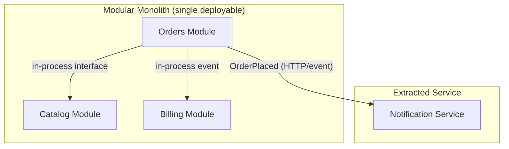

## Purpose

Choosing microservices before a team needs the operational complexity they bring is one of the most common architecture mistakes; choosing a tangled monolith when teams genuinely need independent deployability is the opposite mistake. This skill gives explicit criteria for choosing between a modular monolith and microservices, and how to keep a monolith modular enough to split later if needed.

The default recommendation is monolith-first: build a well-modularized monolith, and extract services only when a concrete, evidenced need appears.

## When to use / When NOT to use

**Use this skill when:**

- You are starting a new system and choosing its deployment topology.
- A monolith has grown large enough that team velocity or deploy risk is suffering.
- You are evaluating whether to extract a specific module into its own service.
- Leadership is pushing for microservices without a concrete driving requirement.

**Do NOT use this skill when:**

- The system is small and unlikely to need independent scaling or independent team ownership.
- The team lacks the operational maturity (observability, on-call, deployment automation) microservices require.

## Prerequisites

- skills/20-architecture/domain-driven-design/SKILL.md to identify real bounded contexts as split candidates.
- Team topology information: how many teams, and do they need to deploy independently.
- Current pain points documented (deploy time, coupling, scaling limits) if considering a split.

## Workflow

1. **Start with a modular monolith by default** - Organize code into modules matching bounded contexts, each with a clear internal API, inside one deployable unit.
2. **Enforce module boundaries in-process** - Prevent modules from reaching into each other's internal types/tables; force communication through defined interfaces or in-process events.
3. **Track concrete pain signals** - Monitor deploy frequency conflicts, scaling mismatches between modules, and team coordination overhead as objective signals.
4. **Evaluate extraction only when a signal is real** - Extract a module to its own service when it has a genuinely different scaling profile, release cadence, or ownership need.
5. **Extract along existing module boundaries** - Only extract a module that is already cleanly bounded internally — extraction does not fix a poorly modularized monolith.
6. **Define the service contract before extraction** - Design the new service's API/events first, then move code behind that contract.
7. **Invest in operational readiness before splitting** - Confirm observability, deployment automation, and on-call processes can support an additional independently deployed unit.

## Decision guide

| Situation | Recommended approach |
| --- | --- |
| Small team, unclear domain boundaries | Stay with a modular monolith; premature service boundaries will be wrong and costly to fix. |
| One module needs to scale 100x independently of the rest | Good candidate for extraction into its own service. |
| Two teams keep blocking each other's deploys | Consider extraction if the blocking module has a clean internal boundary already. |
| Team lacks mature CI/CD and observability | Invest in operational maturity first; do not add service count before you can operate what you already have. |
| A module has fundamentally different technology needs | e.g. a CPU-bound ML component may justify a separate service even at small scale. |
| Leadership wants microservices for its own sake | Push back with the monolith-first default and require a concrete signal before agreeing to split. |

## Reference implementation

A modular monolith with clear internal module boundaries, and one already-extracted service:



- Orders-to-Catalog and Orders-to-Billing stay in-process because they need strong consistency and low latency today.
- Notifications was extracted because it has a different scaling profile (bursty, fan-out) and no consistency requirement with Orders.

### Enforcing module boundaries inside a monolith (C#)

A simple internal-visibility pattern that keeps modules honest before any service split:

```csharp
// Catalog module's public surface — the only thing Orders may reference
namespace Catalog.Public;
public interface ICatalogQueries
{
    Task<ProductSummary?> GetProductAsync(Guid productId);
}

// Internal implementation and EF entities stay non-public to other modules
namespace Catalog.Internal;
internal class CatalogQueries : ICatalogQueries
{
    private readonly CatalogDbContext _db; // never referenced outside this module
    public CatalogQueries(CatalogDbContext db) => _db = db;

    public async Task<ProductSummary?> GetProductAsync(Guid productId) =>
        await _db.Products.Where(p => p.Id == productId)
            .Select(p => new ProductSummary(p.Id, p.Name, p.Price))
            .FirstOrDefaultAsync();
}
```

## Checklist

- [ ] The default starting point was a modular monolith unless a concrete signal justified otherwise.
- [ ] Module boundaries match real bounded contexts, not arbitrary technical layers.
- [ ] Cross-module access goes through defined public interfaces, never internal types or tables directly.
- [ ] Any proposed service extraction is backed by a documented, concrete pain signal.
- [ ] The extracted module was already cleanly bounded before extraction, not entangled.
- [ ] Operational readiness (observability, deploy automation, on-call) was confirmed before adding a new service.

## Anti-patterns

- **Microservices-first without evidence** - Splitting into services at project kickoff because 'that's how it's done', before any real scaling or team boundary need exists.
- **Distributed monolith** - Extracting services that still share a database or require synchronous calls for every operation, getting all the downsides of both models.
- **Big ball of mud monolith** - A monolith with no internal module boundaries, making a future split (if ever needed) extremely expensive.
- **Splitting along technical layers** - Extracting a 'database service' or 'business logic service' instead of splitting along business capability boundaries.
- **Ignoring operational readiness** - Adding services faster than the team's ability to operate, monitor, and deploy them independently.

## Verification

- A dependency check confirms modules only communicate through defined public interfaces.
- Any existing service split can be justified with a documented pain signal that existed before extraction.
- The team can deploy, monitor, and support every currently existing service independently.
- New module boundaries align with the domain model from skills/20-architecture/domain-driven-design/SKILL.md.

## References

- Sam Newman, 'Building Microservices'.
- Martin Fowler, 'MonolithFirst'.
- skills/20-architecture/domain-driven-design/SKILL.md
- skills/60-devops/kubernetes-deployment/SKILL.md
