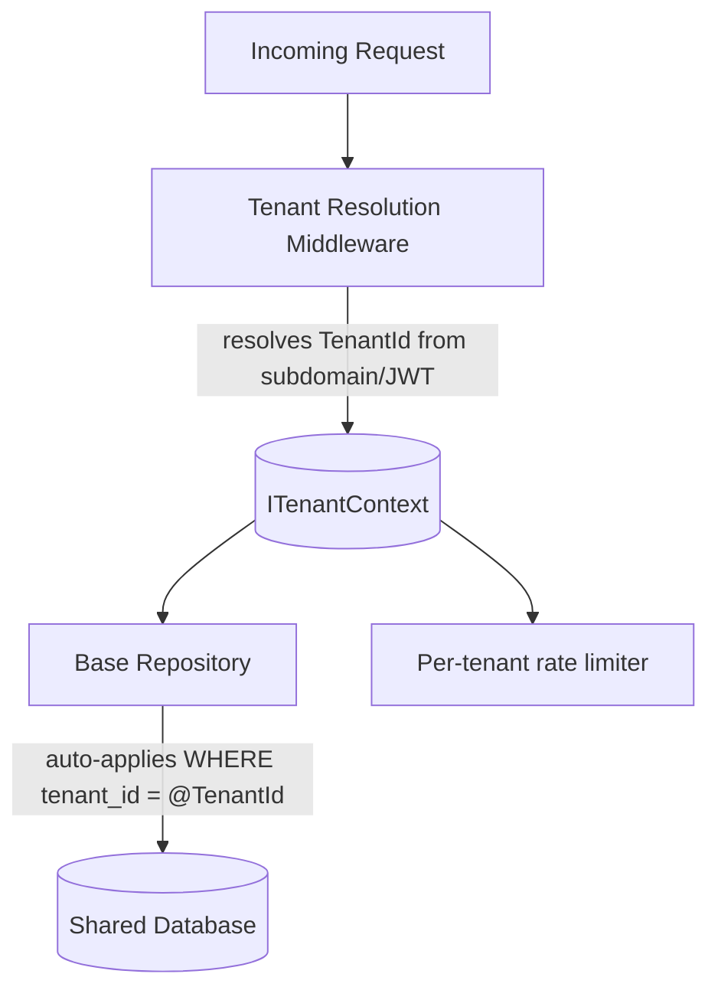

## Purpose

Multi-tenant systems must balance per-tenant data isolation, cost efficiency of shared infrastructure, and the operational burden of managing many tenants. Choosing the wrong tenancy model early is expensive to change later, especially once customer data is commingled or contractually isolated tenants need separating out.

This skill covers the three common tenancy models — shared schema, schema-per-tenant, and database-per-tenant — and how to enforce tenant isolation correctly regardless of which is chosen.

## When to use / When NOT to use

**Use this skill when:**

- You are designing a new SaaS product that will serve multiple customer organizations.
- An existing single-tenant system needs to become multi-tenant.
- A customer requires contractual data isolation (dedicated infrastructure) beyond the platform default.
- You are debugging a tenant data isolation or cross-tenant leakage concern.

**Do NOT use this skill when:**

- The system will only ever serve a single customer/organization.
- Tenants are so few and so large that dedicated infrastructure per tenant is clearly simpler and required anyway.

## Prerequisites

- Confirmed tenant model: how tenants are identified (subdomain, header, claim) at request time.
- skills/30-backend/authentication-and-authorization/SKILL.md for tenant-aware authorization.
- Compliance/contractual requirements for tenant isolation, if any.

## Workflow

1. **Choose the tenancy model deliberately** - Shared schema (row-level tenant ID) for cost efficiency at scale; schema/database-per-tenant for stronger isolation or compliance needs.
2. **Establish tenant context early in the request pipeline** - Resolve the tenant ID from the request (subdomain, header, JWT claim) in middleware, before any business logic runs.
3. **Enforce tenant isolation at the data layer** - Apply a mandatory tenant filter on every query — ideally enforced structurally, not left to each query author's discipline.
4. **Isolate noisy-neighbor resource usage** - Apply per-tenant rate limits or resource quotas so one tenant cannot degrade service for others.
5. **Plan for tenant-specific configuration** - Support per-tenant feature flags, branding, or limits without duplicating core application logic.
6. **Support tenant lifecycle operations** - Design explicit provisioning, offboarding, and data export/deletion flows per tenant from the start.
7. **Test cross-tenant isolation explicitly** - Write automated tests that assert tenant A can never see or modify tenant B's data.

## Decision guide

| Situation | Recommended approach |
| --- | --- |
| Many small tenants, cost efficiency matters most | Use a shared schema with a mandatory tenant_id column and row-level enforcement. |
| Few large tenants with strict compliance/isolation needs | Use database-per-tenant (or schema-per-tenant) for stronger physical isolation. |
| A specific enterprise customer contractually requires dedicated infrastructure | Provision database-per-tenant just for that tenant while others remain on shared schema. |
| Tenant ID is only checked in application code, not enforced at the data layer | Add a structural enforcement mechanism (e.g. row-level security, or a base repository that always injects the filter) instead of relying on every developer remembering. |
| A tenant needs to be fully offboarded and data deleted | Ensure the tenancy model supports clean, verifiable deletion of exactly that tenant's data. |
| One tenant's usage spikes and affects others | Apply per-tenant rate limiting/quotas rather than a single global limit. |

## Reference implementation

Tenant context resolution and enforcement flow for a shared-schema model:



- Resolving tenant context in middleware ensures no code path can accidentally run without a known tenant.
- Auto-applying the tenant filter at the repository base class removes reliance on every query author remembering it.

### Enforcing tenant isolation at the EF Core query level (C#)

A global query filter that makes forgetting the tenant_id filter structurally impossible:

```csharp
public class AppDbContext : DbContext
{
    private readonly ITenantContext _tenant;
    public AppDbContext(DbContextOptions options, ITenantContext tenant)
        : base(options) => _tenant = tenant;

    public DbSet<Order> Orders => Set<Order>();

    protected override void OnModelCreating(ModelBuilder modelBuilder)
    {
        modelBuilder.Entity<Order>()
            .HasQueryFilter(o => o.TenantId == _tenant.TenantId);
    }

    public override int SaveChanges()
    {
        foreach (var entry in ChangeTracker.Entries<ITenantScoped>()
                     .Where(e => e.State == EntityState.Added))
            entry.Entity.TenantId = _tenant.TenantId;
        return base.SaveChanges();
    }
}
```

## Checklist

- [ ] A tenancy model was chosen deliberately based on isolation, cost, and compliance needs.
- [ ] Tenant context is resolved once, early in the request pipeline, not re-derived ad hoc in each handler.
- [ ] Tenant isolation is enforced structurally at the data layer, not left to per-query discipline.
- [ ] Per-tenant rate limits or quotas prevent one tenant from degrading others (noisy neighbor).
- [ ] Tenant provisioning, offboarding, and data export/deletion flows are explicitly designed.
- [ ] Automated tests assert that one tenant cannot read or write another tenant's data.
- [ ] A path exists to move a specific tenant to dedicated infrastructure if contractually required.

## Anti-patterns

- **Manual tenant filtering** - Relying on every developer to remember to add WHERE tenant_id = ... to every query, guaranteeing an eventual leak.
- **Tenant ID from an unverified source** - Trusting a tenant ID passed in a request body or unsigned header instead of deriving it from an authenticated identity/claim.
- **No noisy-neighbor protection** - Letting one tenant's traffic spike degrade performance for all other tenants with no per-tenant limits.
- **No offboarding plan** - Building a multi-tenant system with no way to cleanly and verifiably delete a single tenant's data on request.
- **Untested isolation** - Never writing an automated test that actively tries to access another tenant's data and confirms it fails.
- **One-size-fits-all infrastructure** - Refusing to ever support dedicated infrastructure for a tenant, even when a contract requires it, forcing an awkward workaround.

## Verification

- An automated test using tenant A's credentials attempting to access tenant B's data fails as expected.
- A code review or static check confirms every tenant-scoped table has structural (not just conventional) tenant filtering.
- A per-tenant load test confirms one tenant's spike does not measurably degrade another tenant's latency.
- A tenant offboarding run in a test environment confirms all of that tenant's data is fully and verifiably removed.

## References

- skills/30-backend/authentication-and-authorization/SKILL.md
- skills/50-database/relational-data-modeling/SKILL.md
- Microsoft Azure Architecture Center — multi-tenant SaaS patterns.
- skills/80-security/privacy-and-compliance-basics/SKILL.md
