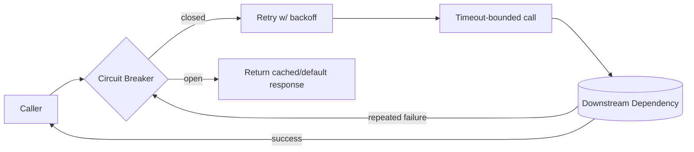

## Purpose

In a distributed system, every network call is a potential failure point, and a naive implementation lets one slow or failing dependency cascade into an outage of the entire system. This skill covers the core resilience patterns — timeouts, retries, circuit breakers, bulkheads, and fallbacks — and when to apply each.

The goal is graceful degradation: a partial failure should cause a partial, contained impact, not a total outage.

## When to use / When NOT to use

**Use this skill when:**

- A service calls another service, database, or third-party API over the network.
- A dependency has occasionally been slow, flaky, or unavailable in the past.
- You need to protect a system from cascading failure when one dependency degrades.
- You are designing SLOs and need to define acceptable degraded-mode behavior.

**Do NOT use this skill when:**

- The call is to a fully in-process, in-memory component with no network or I/O involved.
- Adding resilience patterns to a genuinely non-critical, best-effort call adds more complexity than value.

## Prerequisites

- A resilience library available for the stack (e.g. Polly for .NET).
- Known SLAs/SLOs for the calling service and its dependencies.
- skills/60-devops/observability/SKILL.md to detect when patterns are actually triggering.

## Workflow

1. **Set explicit timeouts on every external call** - Never rely on default/infinite timeouts; choose a value based on the caller's own latency budget.
2. **Add retries with backoff for transient failures** - Retry only on errors known to be transient (timeouts, 5xx, connection resets), with exponential backoff and jitter.
3. **Add a circuit breaker for repeated failures** - Stop calling a consistently failing dependency for a cool-down period instead of retrying into an outage.
4. **Isolate failures with bulkheads** - Use separate connection pools/thread pools per dependency so one slow dependency cannot exhaust resources needed by others.
5. **Define a fallback for degraded mode** - Decide what to return when a dependency is unavailable: cached data, a default value, or an explicit degraded response.
6. **Make retries idempotent-safe** - Confirm the operation being retried is safe to execute more than once, or use an idempotency key.
7. **Combine patterns deliberately** - Layer timeout, retry, and circuit breaker together (timeout inside retry inside circuit breaker) rather than picking just one.
8. **Observe and alert on pattern activation** - Track circuit breaker trips, retry counts, and fallback usage as signals of dependency health.

## Decision guide

| Situation | Recommended approach |
| --- | --- |
| Dependency call fails with a client error (4xx) | Do not retry — it will fail identically; treat as a non-transient failure. |
| Dependency call times out or returns 5xx | Retry a bounded number of times with exponential backoff and jitter. |
| Dependency has been failing repeatedly for the last N requests | Open the circuit breaker to fail fast and give the dependency time to recover. |
| A slow dependency risks exhausting a shared thread/connection pool | Isolate it in its own bulkhead so other calls are unaffected. |
| A degraded dependency has no safe fallback value | Return an explicit, clearly-labeled degraded response rather than pretending the request succeeded fully. |
| An operation is not naturally idempotent | Add an idempotency key before enabling retries, or do not retry it. |

## Reference implementation

Layered resilience patterns applied to a single outbound call:



- The circuit breaker wraps the retry policy, not the other way around — otherwise retries can keep the circuit artificially 'closed' by masking failures.
- Fallback responses should be clearly distinguishable (e.g. a flag in the response) so consumers know they got degraded data.

### Combined timeout, retry, and circuit breaker with Polly (C#)

A realistic resilience pipeline for an HttpClient call to a downstream service:

```csharp
var retryPolicy = Policy
    .Handle<HttpRequestException>()
    .OrResult<HttpResponseMessage>(r => (int)r.StatusCode >= 500)
    .WaitAndRetryAsync(3, attempt =>
        TimeSpan.FromMilliseconds(200 * Math.Pow(2, attempt)) +
        TimeSpan.FromMilliseconds(Random.Shared.Next(0, 100)));

var circuitBreaker = Policy
    .Handle<HttpRequestException>()
    .CircuitBreakerAsync(handledEventsAllowedBeforeBreaking: 5,
        durationOfBreak: TimeSpan.FromSeconds(30));

var timeout = Policy.TimeoutAsync(TimeSpan.FromSeconds(2));

var pipeline = Policy.WrapAsync(circuitBreaker, retryPolicy, timeout);

var response = await pipeline.ExecuteAsync(() => httpClient.GetAsync("/pricing"));
```

## Checklist

- [ ] Every external call has an explicit, deliberately chosen timeout.
- [ ] Retries only apply to genuinely transient failures, with exponential backoff and jitter.
- [ ] A circuit breaker protects against repeatedly calling a consistently failing dependency.
- [ ] Bulkheads isolate resource pools so one slow dependency cannot starve unrelated calls.
- [ ] A defined fallback exists for degraded mode, clearly distinguishable from a full success.
- [ ] Retried operations are confirmed idempotent or protected with an idempotency key.
- [ ] Circuit breaker trips and fallback usage are visible on dashboards with alerting.

## Anti-patterns

- **No timeout** - Making a network call with no timeout, letting a hung dependency exhaust the caller's own resources indefinitely.
- **Retrying non-transient errors** - Retrying 4xx client errors or business validation failures that will fail identically every time.
- **Retry storms** - Retrying without backoff/jitter, causing synchronized retry spikes that make a struggling dependency's outage worse.
- **No circuit breaker** - Continuing to hammer a known-down dependency with new requests instead of failing fast during an outage.
- **Shared resource pools across dependencies** - One slow dependency exhausting a shared connection/thread pool, taking down calls to unrelated, healthy dependencies.
- **Silent degraded responses** - Returning stale/fallback data without any indication to the caller that it is not the full, live result.

## Verification

- A simulated dependency timeout confirms the caller fails fast at the configured timeout, not indefinitely.
- A simulated string of failures confirms the circuit breaker opens and stops calling the dependency.
- A load test with one dependency artificially slowed confirms other dependencies remain unaffected (bulkhead isolation).
- Retried write operations were confirmed idempotent via a test that executes them twice.

## References

- Michael Nygard, 'Release It!' — circuit breaker and bulkhead patterns.
- Polly documentation (.NET resilience library).
- skills/60-devops/observability/SKILL.md
- skills/20-architecture/scalability-and-capacity-planning/SKILL.md
