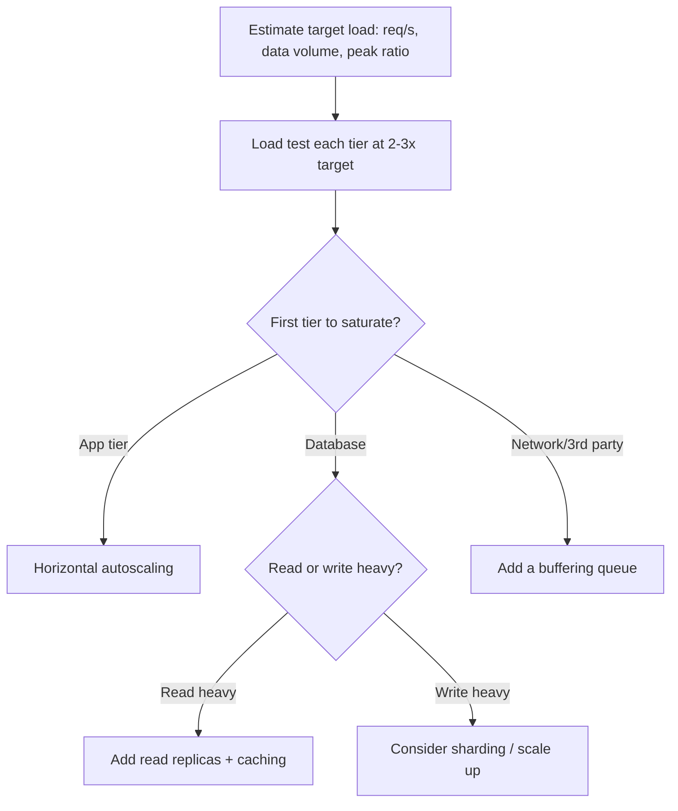

## Purpose

Scaling problems discovered in production during a traffic spike are far more expensive to fix than ones planned for in advance. This skill provides a process for estimating expected load, identifying the likely first bottleneck, and choosing between vertical scaling, horizontal scaling, and architectural changes before they are urgently needed.

It treats capacity planning as an ongoing practice tied to measured data, not a one-time estimate made at launch and never revisited.

## When to use / When NOT to use

**Use this skill when:**

- You are launching a feature expected to see significant or rapidly growing traffic.
- A system is approaching known resource limits (CPU, memory, connections, DB IOPS).
- You need to justify an infrastructure investment or a scaling architecture change.
- A traffic spike (marketing campaign, seasonal event) is planned and capacity needs confirming.

**Do NOT use this skill when:**

- Current and projected load is far below any known system limit with no growth signal.
- The system has no production traffic yet and no reasonable load estimate can be made — focus on launching first, then measure.

## Prerequisites

- Current or projected traffic numbers (requests/sec, data volume, concurrent users).
- Observability in place (skills/60-devops/observability/SKILL.md) to measure actual resource usage.
- Known limits of each component in the current architecture (DB connections, thread pools, etc.).

## Workflow

1. **Establish the load model** - Define expected requests/sec, data growth rate, and peak-to-average traffic ratio, based on real or comparable data.
2. **Identify the first bottleneck** - Load test or model each tier (app, DB, cache, network) to find which one will saturate first at target load.
3. **Choose scale-up vs scale-out for that bottleneck** - Vertical scaling for quick wins on stateful components; horizontal scaling for stateless components that can add instances.
4. **Remove architectural bottlenecks if scaling alone won't work** - e.g. introduce caching, read replicas, or async processing if the bottleneck cannot be solved by adding more of the same resource.
5. **Load test against the target, not just current load** - Test at 2-3x expected peak to leave headroom for unexpected spikes and future growth.
6. **Plan for graceful degradation** - Define what happens when capacity is exceeded (queueing, load shedding, rate limiting) rather than an uncontrolled failure.
7. **Set up autoscaling where applicable** - Configure autoscaling rules based on the metric that actually predicts saturation (not always CPU).
8. **Revisit capacity plans on a cadence** - Re-run the load model as real traffic data accumulates, not just once before launch.

## Decision guide

| Situation | Recommended approach |
| --- | --- |
| Bottleneck is a stateless application tier | Scale out horizontally with an autoscaling group behind a load balancer. |
| Bottleneck is a single relational database | Scale up first for headroom; consider read replicas for read-heavy load or sharding as a last resort for write-heavy load. |
| Traffic is highly spiky (e.g. flash sales) | Add a queue in front of the bottleneck to smooth bursts rather than sizing permanently for peak. |
| Autoscaling reacts too slowly to sudden spikes | Pre-warm capacity ahead of known events (scheduled scale-out) rather than relying purely on reactive autoscaling. |
| A single component cannot scale further no matter what | Consider skills/20-architecture/modular-monolith-vs-microservices/SKILL.md to isolate it for independent scaling. |
| The system approaches capacity but a full redesign is too slow | Apply load shedding and graceful degradation as a stopgap while a longer-term fix is built. |

## Reference implementation

A capacity planning flow identifying the bottleneck before choosing a scaling strategy:



- Always re-run this flow after major traffic pattern shifts, not just once at launch.
- Load test at 2-3x expected peak to leave room for unplanned spikes and future growth.

### A capacity worksheet example

A simple worksheet used to justify a scaling decision with real numbers:

```text
Feature: Checkout API
  Current peak: 150 req/s, DB CPU at 55% during peak
  Projected peak in 6 months (30% MoM growth): ~550 req/s
  Load test result at 550 req/s: DB CPU saturates at 95%, p95 latency 1.2s (SLO: 300ms)
  Bottleneck: Database CPU, primarily from unindexed order-history query
  Decision: add covering index (see indexing-and-query-optimization) + 1 read replica
  Re-test result: DB CPU at 60% at 550 req/s, p95 latency 210ms — meets SLO with headroom
```

## Checklist

- [ ] A concrete load model (req/s, data volume, peak ratio) exists, not a vague estimate.
- [ ] Load testing identified the specific first bottleneck, not a generic guess.
- [ ] The chosen scaling strategy matches the bottleneck type (stateless vs stateful, read vs write heavy).
- [ ] The system was tested at 2-3x expected peak, not just at current or exactly-projected load.
- [ ] Graceful degradation (queueing, load shedding, rate limiting) is defined for beyond-capacity scenarios.
- [ ] Autoscaling rules (if used) trigger on the metric that actually predicts saturation.
- [ ] The capacity plan is revisited periodically against real traffic data, not treated as one-time.

## Anti-patterns

- **Guessing instead of measuring** - Choosing a scaling strategy based on intuition rather than load testing and real traffic data.
- **Scaling the wrong tier** - Adding application servers when the database is the actual bottleneck, wasting cost with no improvement.
- **CPU-only autoscaling** - Scaling purely on CPU when the real constraint is connection pool exhaustion, queue depth, or memory.
- **No headroom** - Sizing exactly for today's projected peak with zero margin for estimation error or unplanned spikes.
- **Uncontrolled overload failure** - Having no load shedding or rate limiting, so exceeding capacity causes a cascading full outage instead of a controlled degradation.
- **One-time planning** - Doing a capacity plan once at launch and never revisiting it as real usage patterns diverge from the original estimate.

## Verification

- A load test report exists showing measured behavior at 2-3x target load, with the bottleneck identified.
- The chosen scaling strategy was validated to resolve the measured bottleneck (re-test after the fix).
- A documented plan exists for behavior beyond capacity (what gets shed or queued first).
- Autoscaling (if configured) was tested to trigger correctly under a simulated load spike.

## References

- skills/50-database/indexing-and-query-optimization/SKILL.md
- skills/70-quality/performance-and-load-testing/SKILL.md
- skills/60-devops/cost-and-resource-optimization/SKILL.md
- Google SRE Book — capacity planning chapter.
