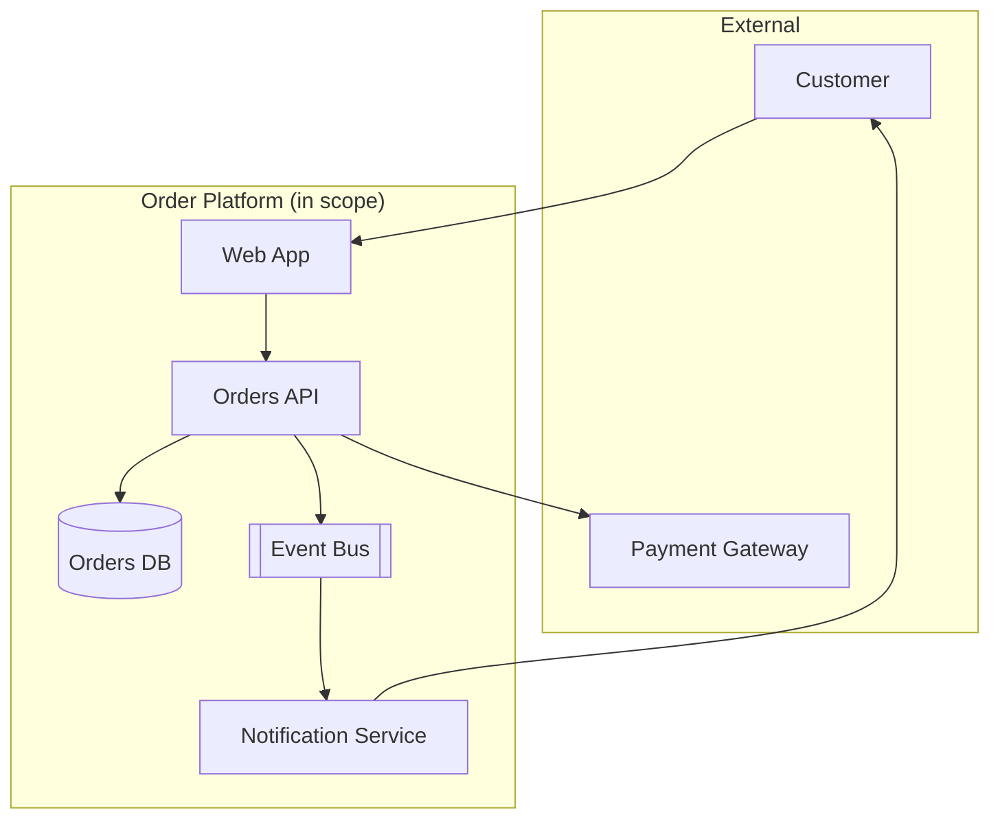

## Purpose

Ad hoc system design produces architectures that are hard to review because the reasoning behind them is invisible. This skill defines a repeatable process — context, requirements, constraints, options, decision, diagram — so architecture proposals can be evaluated on their merits rather than the persuasiveness of whoever presents them.

It is a meta-skill that ties together requirements, ADRs, and the more specific architecture skills in this category into a single end-to-end workflow.

## When to use / When NOT to use

**Use this skill when:**

- You are designing a new service, subsystem, or major integration.
- An existing system needs a significant architectural change (e.g. splitting a monolith).
- You need to communicate a design to reviewers who were not part of early discussions.
- Multiple teams need to agree on system boundaries and contracts before building.

**Do NOT use this skill when:**

- The change is a small, local implementation detail with no architectural impact.
- An architecture already exists and is well documented — use it rather than redesigning.

## Prerequisites

- Confirmed requirements (skills/10-planning/prd-and-spec-writing/SKILL.md).
- Known non-functional requirements: scale, latency, availability, compliance.
- A way to produce diagrams (Mermaid is used throughout this catalog).

## Workflow

1. **Restate the problem and constraints** - Summarize what the system must do and the hard constraints (budget, timeline, team skills, existing systems it must integrate with).
2. **Identify quality attributes** - Rank the top 3 non-functional priorities (e.g. availability over latency, or vice versa) — you cannot maximize all of them equally.
3. **Sketch context and containers** - Draw a system context diagram showing external actors and systems, then a container diagram showing major deployable units.
4. **Generate at least two real options** - Force yourself to consider a genuinely different approach, not just one design dressed up two ways.
5. **Evaluate against quality attributes** - Score each option against the ranked priorities from step 2, not just against 'does it work'.
6. **Record the decision as an ADR** - Use skills/10-planning/architecture-decision-records/SKILL.md for the chosen option and rejected alternatives.
7. **Define interfaces and contracts explicitly** - Specify APIs, events, or data contracts between components before implementation starts.
8. **Review with stakeholders** - Walk the diagrams and ADR through a review before committing engineering time to build.

## Decision guide

| Situation | Recommended approach |
| --- | --- |
| Team is small and the domain is well understood | Prefer skills/20-architecture/modular-monolith-vs-microservices/SKILL.md's monolith-first guidance over premature service decomposition. |
| Strong consistency is required across aggregates | Favor a single transactional boundary over an eventually-consistent distributed design. |
| Multiple independent teams need to ship independently | Favor clear service boundaries with explicit contracts over a shared codebase. |
| Non-functional requirements are still fuzzy | Pause and go back to skills/10-planning/requirements-elicitation/SKILL.md before finalizing the design. |
| Two designs score similarly | Prefer the one with less operational complexity and fewer new technologies for the team. |
| Design review surfaces a blocking disagreement | Record it as an open question in the ADR and escalate rather than silently picking a side. |

## Reference implementation

A system context diagram produced during step 3 of the workflow:



- Keep the context diagram to one page — push implementation detail into container/component diagrams instead.
- Label every arrow with the protocol or contract (REST, event type) so reviewers see explicit boundaries.

### Option comparison table used before the ADR

A structured comparison forces genuine option evaluation instead of confirmation bias:

```text
Priorities (ranked): 1) Availability  2) Cost  3) Latency

Option A: Single region, multi-AZ deployment
  Availability: Good (survives AZ failure)  Cost: Low   Latency: Best
Option B: Active-active multi-region
  Availability: Best (survives region failure)  Cost: High  Latency: Good

Decision: Option A for launch; revisit Option B if regional outage SLAs tighten.
```

## Checklist

- [ ] Requirements and non-functional priorities are explicitly ranked before comparing options.
- [ ] At least two genuinely different options were considered and evaluated.
- [ ] A context diagram and at least one container/component diagram exist.
- [ ] The chosen option is recorded as an ADR with rejected alternatives documented.
- [ ] Interfaces/contracts between components are specified, not left implicit.
- [ ] The design was reviewed with stakeholders before implementation began.
- [ ] Open questions or disagreements from review are tracked, not silently dropped.

## Anti-patterns

- **Diagram-free architecture** - Describing a system only in prose, making it hard for reviewers to spot missing components or unclear boundaries.
- **Single-option design** - Presenting only the chosen design with no real alternative considered, hiding the trade-off reasoning.
- **Resume-driven design** - Choosing a technology because it is new or interesting rather than because it best fits the ranked quality attributes.
- **Implicit contracts** - Leaving API/event schemas undefined until implementation, causing integration surprises between teams.
- **Skipping review** - Starting implementation before stakeholders have seen and agreed to the design.
- **Optimizing everything equally** - Trying to maximize availability, cost, and latency simultaneously instead of explicitly ranking trade-offs.

## Verification

- A reviewer unfamiliar with the discussion can understand the design from the diagrams and ADR alone.
- The chosen option's trade-offs are traceable to the ranked quality attributes.
- Every component-to-component interaction has a named contract (API spec, event schema).
- The ADR documents at least one rejected alternative with reasoning.

## References

- skills/10-planning/architecture-decision-records/SKILL.md
- skills/10-planning/prd-and-spec-writing/SKILL.md
- C4 model (Simon Brown) — context/container/component/code diagram levels.
- skills/20-architecture/scalability-and-capacity-planning/SKILL.md
