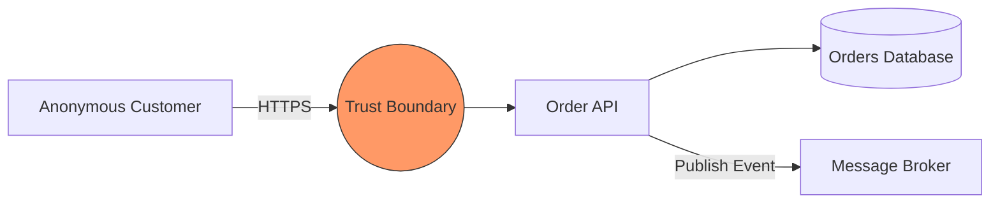

## Purpose

Security issues found during design review are far cheaper to fix than those found after deployment. This skill covers the STRIDE framework (Spoofing, Tampering, Repudiation, Information Disclosure, Denial of Service, Elevation of Privilege) for systematically identifying threats against a system's data flow diagram during the design phase.

It is a structured brainstorming and mitigation-planning technique, entirely defensive and design-focused — it does not involve attempting to exploit any system.

## When to use / When NOT to use

**Use this skill when:**

- You are designing a new feature that handles sensitive data, authentication, or crosses a trust boundary.
- An architecture decision record involves a new external integration or data flow.
- You need a structured way to identify security requirements before implementation begins.

**Do NOT use this skill when:**

- The change is a trivial, low-risk internal refactor with no new trust boundary or data flow.
- You need to actually test whether a threat is exploitable against a live system — see skills/80-security/authorized-penetration-testing/SKILL.md, which requires explicit authorization and is a separate activity.

## Prerequisites

- skills/20-architecture/system-design-process/SKILL.md for the system design being threat-modeled.
- templates/threat-model.template.md for documenting the resulting analysis.

## Workflow

1. **Draw a data flow diagram of the system** - Identify processes, data stores, external entities, and trust boundaries the design crosses.
2. **Walk each element against the STRIDE categories** - For each process/data flow, ask: can it be Spoofed, Tampered with, Repudiated, cause Information Disclosure, Denial of Service, or Elevation of Privilege?
3. **Rate each identified threat's severity** - Consider likelihood and impact together (e.g. using a simple High/Medium/Low or DREAD-style scoring) to prioritize mitigation effort.
4. **Define a mitigation for each significant threat** - Every threat rated Medium or above gets an explicit mitigation strategy documented before implementation begins.
5. **Assign an owner and track mitigations to completion** - A threat model with no follow-through on its mitigations provides false confidence.
6. **Revisit the threat model when the design changes materially** - A new external integration or data flow addition should trigger an update to the existing threat model, not a one-time exercise.
7. **Focus on trust boundaries first** - Threats are most valuable to analyze where data crosses from a less trusted zone to a more trusted one (e.g. public internet to internal API).

## Decision guide

| Situation | Recommended approach |
| --- | --- |
| A new feature accepts data from an external, unauthenticated source | Prioritize Spoofing and Tampering threats at that trust boundary first. |
| A feature logs or stores sensitive user data | Prioritize Information Disclosure threats, considering both storage and transit. |
| A feature performs an action that changes financial or critical state | Prioritize Repudiation threats — ensure sufficient audit logging to prove who did what. |
| A public-facing endpoint has no rate limiting | Flag it as a Denial of Service threat and define a mitigation (rate limiting, resource quotas) before launch. |
| A newly identified threat has no clear mitigation yet | Document it as an accepted risk with an explicit owner and review date rather than leaving it silently unaddressed. |

## Reference implementation

A STRIDE threat model excerpt for a new public order-submission endpoint:

```markdown
## Threat Model: Public Order Submission Endpoint

**Data flow:** Anonymous customer -> POST /orders -> Order Service -> Orders DB

| STRIDE Category         | Threat                                             | Mitigation                                   | Severity |
|--------------------------|-----------------------------------------------------|-----------------------------------------------|----------|
| Spoofing                 | Attacker submits orders as another customer          | Require authenticated session, verify token   | High     |
| Tampering                | Order total manipulated in request payload           | Recalculate price server-side, ignore client total | High |
| Denial of Service        | Endpoint flooded with junk order submissions          | Rate limit per IP/account, CAPTCHA on abuse    | Medium   |
| Information Disclosure   | Error messages leak internal stack traces             | Centralized Problem Details error handling     | Medium   |
| Elevation of Privilege   | Admin-only discount codes usable by regular customers  | Server-side role check on discount application | High     |
```

- Each row maps directly to a concrete, testable mitigation, not a vague 'be careful' note.
- Severity ratings drive which mitigations must be implemented before launch versus tracked as follow-up work.

### A data flow diagram sketch identifying trust boundaries (Mermaid)

Visualizing where data crosses from a less trusted to a more trusted zone:



## Checklist

- [ ] A data flow diagram identifying trust boundaries exists for the system being modeled.
- [ ] Each element crossing a trust boundary is analyzed against all six STRIDE categories.
- [ ] Every threat rated Medium or above has an explicit, documented mitigation.
- [ ] Mitigations are assigned an owner and tracked to completion, not just documented and forgotten.
- [ ] The threat model is revisited when the design materially changes (new integration, new data flow).
- [ ] The exercise remains defensive/design-focused; no actual exploitation is attempted as part of it.

## Anti-patterns

- **Threat modeling after launch** - Only considering security threats once the system is already in production, missing the cheapest point to address them.
- **Threats with no mitigation** - Documenting a long list of identified threats with no corresponding mitigation plan or owner, providing false confidence.
- **One-time exercise** - Creating a threat model once at project start and never updating it as the system gains new integrations or data flows.
- **Skipping trust boundary analysis** - Analyzing internal, fully-trusted code paths in detail while ignoring the actual external-facing trust boundary where real threats concentrate.
- **Vague, unranked threat lists** - Listing threats with no severity rating, making it impossible to prioritize which ones need mitigation before launch.

## Verification

- A threat model document exists for every feature that introduces a new trust boundary or handles sensitive data.
- Every High-severity threat in the model has a corresponding implemented mitigation, verified before launch.
- The threat model is version-controlled and shows updates corresponding to significant design changes over time.
- A sample review confirms mitigations map to concrete, testable controls, not vague statements.

## References

- skills/20-architecture/system-design-process/SKILL.md
- templates/threat-model.template.md
- Microsoft — The STRIDE Threat Model.
